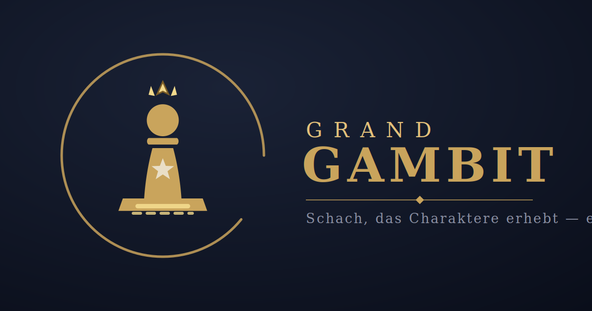

# ♟ Grand Gambit



**Schach, das Charaktere erhebt.** Ein Story-getriebenes Taktik-Schach-RPG im
Browser: Figuren leveln, lernen Fähigkeiten und Schilde, besiegte Bosse werden
rekrutiert — und ein einziger Bauer trägt das Wappen, um das sich alles dreht.
Zehn Ligen, zehn Klimazonen, Nebel des Krieges, optionaler Online-Modus.

**Stack:** React 18 + Vite 5 · deterministischer, UI-freier Spielkern
(Command/Event-Sim mit Replay) · 115 KB gzip · PWA · 228 automatisierte Checks

## Entwicklung

```bash
npm install
npm run dev            # lokal spielen (http://localhost:5173)
npm test               # komplette Testsuite
npm run build          # Web-/PWA-Build → dist/
npm run build:single   # alles in EINER HTML-Datei → dist-single/
```

## Deployment

Jeder Push auf `main` deployt automatisch über **Cloudflare Pages**
(Build `npm run build`, Output `dist`, `NODE_VERSION=22`).
Schnell-Deploy aus dem Claude-Chat und alle weiteren Wege:
→ [RELEASE-ANLEITUNG.md](RELEASE-ANLEITUNG.md)

## Weitere Handbücher

- [assets/README.md](assets/README.md) — Figuren & Karten-Bausteine als SVG bearbeiten
- [ACCOUNTS-ANLEITUNG.md](ACCOUNTS-ANLEITUNG.md) — alle Konten für itch.io, Google Play & Co.
- [CHANGELOG.md](CHANGELOG.md) — Versionshistorie

© 2026 — Alle Rechte vorbehalten. Siehe [LICENSE](LICENSE).
